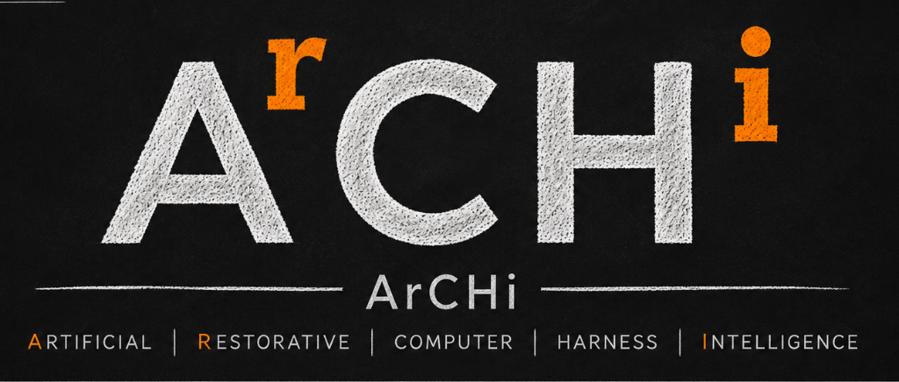

# ArCHi

<p align="center">
  <a href="https://rawlabs.github.io/ArCHi/site/logo_animation.html">
  
  </a>
</p>

ArCHi is a local voice assistant for **Omarchy/Hyprland**. Speak a short
command to open an app, adjust zoom or volume, read the clipboard, or control
a window. Speech recognition, routing, and speech output run locally.

The current beta is for Omarchy/Hyprland, with local speech tools configured during installation.

## Quick start

Once [installed](#installation) with the `Super+R` and `Escape` bindings configured:

1. Press **Super+R** to start listening.
2. Say a command from the examples below.
3. Press **Super+R** again, or say **“ArCHi stop”**, to submit.
   Press **Escape** while listening to cancel without running it.
4. ArCHi shows the recognized command and reports the result.

| Say | Result |
| --- | --- |
| `open downloads` | Opens your Downloads folder |
| `open cliamp` | Opens cliamp if it is installed; use another installed app's name too |
| `open browser` | Opens the default browser listed in your app menu |
| `switch to browser` | Focuses the most recently used matching browser window |
| `close the browser` | Requests that browser window close, even when another app has focus |
| `close cliamp` | Requests that app's window close; reports if it still needs attention |
| `zoom` → `more` → `less` | Adjusts native screen zoom with short follow-ups |
| `zoom out` | Resets zoom to normal |
| `volume up` / `volume down` | Adjusts system volume |
| `read clipboard` | Reads clipboard text aloud |
| `stop speaking` | Stops Pocket TTS playback |
| `off record` / `logging on` | Pauses or resumes local diagnostic logging |

Say `open` followed by an app's menu name. ArCHi rescans menu entries for every
command, so installing or removing an app needs no command-registry edit.
Run `archi-cheatsheet` to see the discovered apps and accepted opening phrases.

Recording submits automatically after 120 seconds. ArCHi listens only during
an explicitly started capture. Logs include transcripts and desktop context
by default; say **“off record”** before sensitive work.

See [voice controls](docs/VOICE_CONTROLS.md) for follow-ups and
[the command reference](docs/TESTING.md) for the full phrase list. Unknown or
ambiguous commands perform no desktop action.

The presentations in [the project idea](#the-idea-behind-archi) explain the broader direction. The concept film includes
proposed confirmation behavior beyond the current beta.

## Installation

You need Omarchy/Hyprland, Python 3.11+, a configured
[Voxtype](https://github.com/peteonrails/voxtype) installation, and a local
speech backend. See [requirements](#requirements-for-the-current-prototype)
for the full tool list and hardware guidance. The installer copies ArCHi;
it does not install Voxtype or a speech service.

```bash
git clone https://github.com/RawLabs/ArCHi.git
cd ArCHi
./install.sh
~/.local/bin/archi-doctor
```

Add the `Super+R` toggle and `Escape` cancel bindings from the
[installation guide](docs/INSTALL.md), then reload Hyprland. Keybindings are
configured manually. Keep `~/.local/bin` on your `PATH` so they can find the
installed helpers.

## Requirements for the current prototype

- Omarchy / Hyprland
- Python 3.11+
- [Voxtype](https://github.com/peteonrails/voxtype) for local voice capture
- PipeWire tools: `pw-play`, `pw-record`, `wpctl`, and `pw-dump`
- `curl`, `jq`, `wl-clipboard`, and `hyprctl`
- `gtk-launch` (GTK 3), `xdg-open` (`xdg-utils`), `pactl` (`libpulse`),
  `flock` (`util-linux`), and `iconv` for application launching, mute control,
  speech locking, and text validation
- a local TTS backend: Pocket TTS-compatible HTTP endpoint (the default,
  `http://127.0.0.1:8000/tts`) or an executable set in `ARCHI_TTS_SAY`

### Local voice hardware profiles

The package and non-voice commands are light. The optional local voice stack is
not: on the tested low-end system, Voxtype used roughly 285 MB after warm-up and
Pocket TTS used roughly 1.1 GB resident memory.

| Profile | Tested guidance | Speech output |
| --- | --- | --- |
| Below minimum | Fewer than 4 logical CPUs, less than 8 GiB RAM, or no AVX2 | Use `espeak-ng` when speech is needed; voice capture can be slow. |
| Minimum | 4 logical CPUs, 8 GB RAM class (about 7.5 GiB reported), AVX2, and SSD storage | Use Piper for a balanced local voice. Expect several seconds of transcription latency after recording stops. |
| Recommended | 8 logical CPUs, 16 GiB RAM, and 8 GiB free SSD space | Pocket TTS is practical when its higher memory use is acceptable. |

Run `archi-doctor` after setup to see the detected profile and active TTS path.
The profile is advisory: it never prevents use of a configured local backend.

`hassil` is optional. When installed, it only compares parsing results for
diagnostics; it does not execute commands.

## Configuration and voice options

The source installer puts helpers in `~/.local/bin` and runtime data in
`~/.local/share/archi`. It preserves your active command registry. To replace
it with current defaults and keep a timestamped backup, run
`./install.sh --refresh-registry`.

Useful override variables:

- `ARCHI_HOME`: installed ArCHi data directory, default
  `~/.local/share/archi`;
- `ARCHI_BIN_DIR`: helper script directory, default `~/.local/bin`;
- `ARCHI_COMMANDS_PATH`: command registry path;
- `ARCHI_APPLICATION_DIRS`: optional colon-separated desktop-entry directories
  used instead of the standard XDG, Flatpak, and Snap locations;
- `ARCHI_APP_ALIASES_PATH`: optional local spoken-app alias registry, default
  `${XDG_CONFIG_HOME:-$HOME/.config}/archi/app-aliases.toml`;
- `ARCHI_DESKTOP_ADAPTER`: desktop integration ID, currently `omarchy` or
  `omarchy.hyprland`;
- `ARCHI_INTENTS_PATH`: independent HassIL diagnostic grammar path;
- `ARCHI_LOG_PATH`: command diagnostic log path;
- `ARCHI_FEEDBACK`: `minimal` (default) or `off` for transient visual command
  feedback;
- `ARCHI_TTS_SAY`: speech helper used by the router;
- `ARCHI_TRANSCRIPT_WAIT_TICKS`: transcript wait in tenths of a second,
  default `1200` (120 seconds, with immediate completion when ready);
- `ARCHI_MAX_RECORDING_SECONDS`: hard recording limit, default and maximum
  `120`;
- `POCKET_TTS_URL`, `POCKET_TTS_VOICE`, `POCKET_TTS_VOICE_FILE`, and
  `POCKET_TTS_VOLUME`: speech endpoint, voice, voice sample, and volume;
- `POCKET_TTS_TIMEOUT_SECONDS`: timeout for each TTS request, default `60`;
- `POCKET_TTS_DUCK_FACTOR`: volume multiplier for other playback while ArCHi
  speaks, default `0.25`.

ArCHi uses Pocket TTS's named voice `alba` by default. No custom voice sample
or ElevenLabs account is needed. Set `POCKET_TTS_VOICE` to choose another named
voice supported by your local endpoint.

For an optional custom voice, browse the
[ElevenLabs Voice Library](https://elevenlabs.io/app/voice-library) for
“Savvy — warm, grounded & natural” or another voice. Download an audio sample
you have permission to use as a local voice reference, then follow the
[custom voice setup](docs/INSTALL.md#optional-custom-voice). Samples are supplied
by the user and are not bundled with ArCHi.

To enable optional HassIL shadow comparison without modifying the system
Python environment:

```bash
uv pip install --target "${ARCHI_HOME:-$HOME/.local/share/archi}/vendor" 'hassil>=3,<4'
```

## Beta status

ArCHi `0.1.0b1` is in beta testing on Omarchy/Hyprland. The beta covers the
explicit voice-command flow, dynamic installed-app routing, action execution,
local diagnostics, HassIL shadow comparison, and transparent status feedback.
It has no wake word, background microphone listener, voice-controlled
dictation, general capability broker, or tested non-Omarchy desktop adapter.
See [beta operations](docs/BETA.md) for the supported scope and test loop.

## Safety and privacy

ArCHi runs operational capability definitions from `config/commands.toml` and
discovers applications from desktop entries already trusted by the Linux
application launcher. Machine commands are owned by the selected adapter;
remaining helper actions use argv arrays, never shell strings.

The default log contains command transcripts and desktop context. Use “off
record” before sensitive work, or set `ARCHI_LOG_PATH` to a location you
control. Do not commit logs or voice recordings. Clipboard readout is not
logged.

## Current implementation

The current beta follows this command path:

```text
Voxtype explicit capture
        |
deterministic allowlisted router
        |
capability + desktop adapter boundary
        |
Omarchy / Hyprland actions + Pocket TTS speech
```

It currently:

- routes recognized phrases through a small allowlisted command registry;
- discovers installed applications from the live XDG desktop-entry registry,
  enabling commands such as `open cliamp` and `close cliamp` without adding
  per-application configuration. App names may contain spaces, may be spoken
  as separate letters (`open c l i a m p`), and accept a conservative q/c/k
  phonetic equivalence;
- refreshes the app list for every command, using app-menu entries and honoring
  hidden entries, desktop visibility, executable checks, and Omarchy's menu hide
  list. `archi-cheatsheet` lists discovered apps and an accepted opening phrase;
- resolves everyday names such as browser, terminal, file manager, editor,
  video player, image viewer, and PDF viewer through desktop defaults. Music
  and calculator aliases resolve when one installed app owns that role;
- accepts `open`, `launch`, `start`, `close`, `quit`, `exit`, and `dismiss`
  followed by an app name, with optional “the.” Use `switch to`, `focus`, or
  `show` to bring an existing app window forward; closing targets its most
  recently focused window and allows the app to show unsaved-changes prompts;
- stops and submits capture with the same `Super+R` toggle or the active-only
  spoken terminator “ArCHi stop”;
- provides spoken responses through a configurable local TTS helper or a
  Pocket TTS-compatible endpoint;
- keeps ArCHi's spoken-response volume separate from system volume and shows
  an Omarchy OSD volume indicator;
- supports read-aloud, system audio, windows, screenshots, and workspace
  actions through the `omarchy.hyprland` adapter;
- controls Omarchy's native screen zoom with phrases such as `zoom`, `more`,
  `less`, `zoom out`, and `cancel`. Short follow-ups also work after a volume
  command; see [voice controls](docs/VOICE_CONTROLS.md);
- records local command diagnostics by default, with an “off record” command;
- shows short, transparent command-status overlays through the selected desktop
  adapter. On Omarchy these use `omarchy-osd`, not the system notification
  center; set `ARCHI_FEEDBACK=off` to disable them;
- keeps the optional intent-parser integration observational: it never chooses
  commands.

This slice now has its first capability/adapter boundary, but it does not yet
contain the general multi-provider broker, AT-SPI integration, Speech
Dispatcher, braille, portals/libei, or vision fallback. See the
[platform support policy](docs/SUPPORT.md) and [roadmap](docs/ROADMAP.md).

## The idea behind ArCHi

ArCHi is the everyday brand name, while the conceptual reading **AʳCHⁱ** encapsulates its three architectural pillars:

1. **01. The Computer Harness — A·C·H:** Linux already has a remarkable collection of tools: window controls, audio systems, accessibility services, input devices, magnifiers, and speech tools. ArCHi's Computer Harness connects to what is already available on your system, learns where the useful pieces are, and gives them a common place to work from. No need to replace Linux—the penguin was here first.
2. **02. Restorative Intelligence — r·i:** Restorative Intelligence turns human intent into an action the computer understands. Spoken commands, dictated instructions, keyboard actions, pointer movements, or accessibility controls all represent the same thing: intent. Less hunting through menus, less mouse mileage, and considerably less finger gymnastics.
3. **03. ArCHi:** Put the two together and you get ArCHi: a harness that understands the Linux system beneath it, and an intelligence that understands the person in front of it. Magnification beside hands-free control, dictation beyond typing—because sometimes the accessibility problem isn't that the tool doesn't exist; it's that the tools won't talk to each other.

ArCHi is not intended to become another screen reader, speech engine, braille
driver, or general-purpose desktop agent. Those systems remain the experts.
ArCHi asks for capabilities such as `action.activate`, `output.speak`, or
`context.focused_control` and routes each request to an installed provider.

<p align="center">
  <strong><a href="https://rawlabs.github.io/ArCHi/site/logo_animation.html">▶ Watch the animated project introduction</a></strong>
  &nbsp; · &nbsp;
  <strong><a href="https://rawlabs.github.io/ArCHi/site/concept_film.html">▶ Watch the concept film</a></strong>
</p>

## Direction

The near-term product is natural voice control of Omarchy's existing features.
ArCHi should add context and accessible feedback around those features, not
rebuild zoom, dictation, or desktop settings. The broader provider architecture
below is a longer-term option, not a prerequisite for useful voice controls.

The target architecture separates five provider roles:

```text
input -> normalized intent -> context + policy -> action
                                      |
                               output + feedback
```

- `InputProvider` turns voice, keys, switches, braille keys, gestures, or
  future sensors into normalized input events.
- `ContextProvider` reports relevant semantic or desktop state without taking
  action.
- `ActionProvider` performs a narrowly described, policy-approved operation.
- `OutputProvider` presents requested content through speech, braille,
  captions, or another channel.
- `FeedbackProvider` reports short status, confirmation, warning, or failure
  cues independently of content output.

Providers advertise capabilities; the broker selects among them. Core intent
must not depend on commands such as `hyprctl`, on a particular synthesizer, or
on screenshot coordinates. A request such as “activate Save” should prefer a
semantic accessible action, then an application or compositor-native action,
and use permissioned pixel/pointer control only as a guarded fallback. If the
target cannot be established safely, ArCHi asks rather than guesses.

The detailed contracts, fallback rules, and trust boundaries live in the
[architecture notes](docs/ARCHITECTURE.md).

## Design commitments

- **Integrate before inventing.** Use AT-SPI, Orca, Speech Dispatcher,
  BRLTTY/BrlAPI, desktop portals, libei, and desktop settings through adapters
  where they fit.
- **Capabilities, not implementations.** User intent and profiles do not name
  a particular desktop command or device backend.
- **Deterministic by default.** Executable actions remain allowlisted and
  inspectable. Optional probabilistic components may propose context or intent;
  they do not silently expand authority.
- **Semantic before visual.** Prefer the accessibility tree and native
  application actions over screenshots and coordinate clicks.
- **Ask rather than guess.** Ambiguity, missing permission, and unavailable
  capabilities are normal broker outcomes.
- **User-directed channels.** Profiles describe preferred interaction channels
  and constraints, not diagnoses.
- **Explicit activation and consent.** The default input is a deliberate
  start/stop toggle, and
  privileged capture or input control must preserve portal/compositor consent.
- **Local and private by default.** Transcripts, context, and diagnostics stay
  local unless a user deliberately configures otherwise.

## Project layout

```text
src/archi/       router, XDG application registry, and adapter contracts
src/archi/adapters/  tested machine-specific desktop integrations
config/          allowlisted command profile and diagnostic intent grammar
scripts/         capture control, verbal stop, TTS, and utility entry points
docs/            architecture, roadmap, installation, and testing notes
tests/           current prototype behavior tests
```

See the [testing cheat sheet](docs/TESTING.md) for the current key map, every
accepted phrase, and the prototype test matrix. See the
[architecture notes](docs/ARCHITECTURE.md) for current and target runtime flows.
The [platform support policy](docs/SUPPORT.md) defines tested compatibility.
The first planned provider-selection plugin is specified in
[the magnifier PoC](docs/MAGNIFIER_PLUGIN_POC.md).
The near-term, bounded beta extensions are documented in
[Beta+ delivery path](docs/BETA_PLUS.md).

## Before release beyond beta

Add contribution and security guidance, test on a fresh
Omarchy account, validate a second desktop adapter, and package the project for
the supported distributions.

## License

ArCHi's original code and documentation are available under the
[MIT License](LICENSE).

Third-party voice samples and generated demo audio retain their provider's
terms; the MIT license does not relicense them. Demo audio uses ElevenLabs
voices ([elevenlabs.io](https://elevenlabs.io)). Custom voice references are
supplied locally by the user and excluded from Git.
